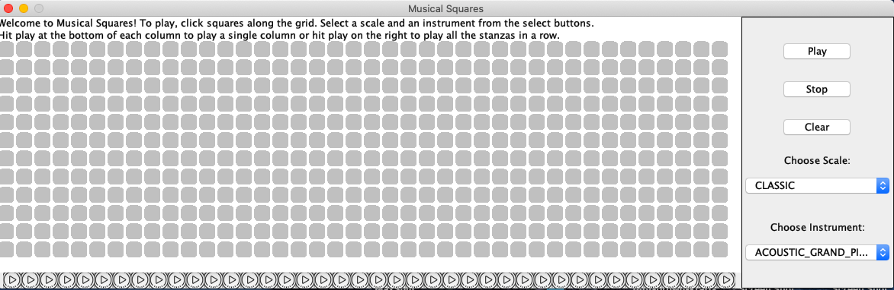

# Musical Squares  

Welcome to Musical Squares. This project allows a user to user various instruments and different scales to create a song.    
The application uses the Javax sound library to create notes.   

You can check out the jar file [here](build/libs/MusicalSquares-1.0-SNAPSHOT.jar). 
  
 ### How to Use
 
 1. Each column represents a stanza. Click notes (squares) on the column. 
 2. Use the drop downs on the right to select the instrument and scale. 
 3. You can either:
  - hit the play icon at the bottom of the column to play a whole stanza at once (like a chord)
  - hit the play button on the right. This will trigger the application to loop through all of your stanzas and play them all one after the other.
 
Don't like your song? Hit the stop button on the right to stop midway.     
   
Wanna make another song? You can then hit clear to start again!     

 
 ### Contributers
 
 Shoshana Weinfeld (https://github.com/shweinfeld)   
 Sara Orlin (https://github.com/SaraOrlian)   
 Ester Agishtein (https://github.com/ester-agishtein)

